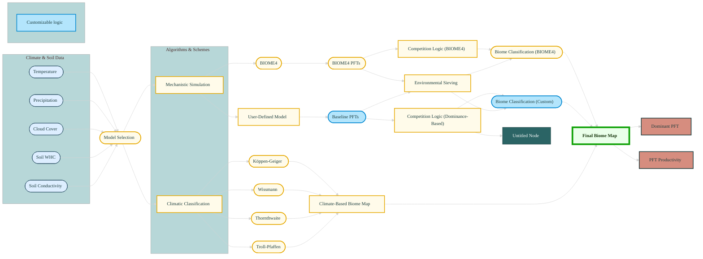

<p align="middle">
  
</p>

[](https://github.com/clechartre/BIOME5/actions/workflows/pre-commit.yml)
  <a href="https://mit-license.org">
    
  </a>

# Biome.jl: A Package for simulating biome schemes

Biome.jl is a package that provides a platform for simulating climate-driven biome classification schemes alongside the mechanistic model BIOME4 and provide a framework for customizing your own mechanistic biome definition based on the scheme of BIOME4. 

The BIOME4 equilibrium global vegetation model was first used in experiments described in Kaplan et al. (2003). The computational core of the model was last updated in 1999, and at the time was called [BIOME4 v4.2b2 ](https://github.com/jedokaplan/BIOME4). For more information about the original model, please refer to: [Kaplan, Jed & Prentice, Iain. (2001). Geophysical Applications of Vegetation Modeling.](https://www.researchgate.net/publication/37470169_Geophysical_Applications_of_Vegetation_Modeling)

This GitHub repository contains the translation to Julia of the original FORTRAN77 computational core to run on sample input data, also provided in this repository.

The original code works with a main routine and subroutines. You can see the infrastructure in the following graph. In this Julia version, we kept the overall structure where higher level modules call functions from sub-modules.



Below an example of output generated with the model using the Kaplan BIOME4 logic.

<p align="middle">
  
</p>

# Installation Instructions

To run Biome.jl using Julia, you need to set up the required environment by installing the necessary dependencies. The environment is defined in the `Project.toml` and `Manifest.toml` files, which ensure reproducibility.

1. **Install Julia**:  
   First, ensure that Julia is installed on your system. You can download the latest version from the official Julia website: [https://julialang.org/downloads/](https://julialang.org/downloads/).

2. **Clone the Repository**:  
   Clone this repository to your local machine:
   ```bash
   git clone https://github.com/yourusername/Biome.jl.git
   cd Biome.jl
   ```

3. ***Activate the Project**:
    Inside the repository, activate the project environment using Julia’s built-in package manager. Open a Julia REPL by typing julia in your terminal, then run: 
    ```
      using Pkg
      Pkg.activate(".")
      Pkg.instantiate()
    ```

# Requirements in Input data:

## Climate Enveloppe Models 

## Mechanistic Models 
BIOME4 requires the following variables to run (in the form of gridded fields):

- climatological monthly mean fields of temperature (°C)
- climatological monthly mean cloud cover (%)
- climatological mean monthly total precipitation (mm)
- soil water holding capacity in two or more layers (mm/mm)
- soil saturated conductivity in two or more layers (mm/h)

BIOME4 also requires a single global value for atmospheric CO₂ concentrations

### The input generation scripts
Since we want to be able to generate our own input data, we've created 3 input generation scripts, available in `utils/data_generation`. 

See the previous sections for description of the datasets and where to retrieve them.

#### 1. Climatological data 
The Climatological data, temperature, tmin, cloud cover, and precipitation is downloaded from the [CHELSA database](https://chelsa-climate.org/bioclim/). Each variable is downloaded for a specified year, for each month of the year. 
Aside for yearly data, the CHELSA database also provides averaged datasets over longer time periods. 

#### 2. Soil characteristics data
The data on soil characteristics are generated using the [makesoil](https://github.com/ARVE-Research/makesoil) module from Arve research. This script will automatically generate a NetCDF file with the two variables that are necessary to run BIOME4: the soil water holding capacity (whc), and the soil saturated conductivity (Ksat).

## Running your first Model
This package can be executed using specific environmental data files. The script requires at minimum a temperature and a precipitation file for the climate enveloppe models. 
For running the mechanistic models, a cloud cover file, soil characteristics and CO2 will be required. 

```
using Biome
using Rasters

tempfile = "temp_1981-2010.nc"
precfile = "prec_1981-2010.nc"
cltfile = "sun_1981-2010.nc"
soilfile = "soils_55km.nc"

temp_raster = Raster(tempfile, name="temp")
prec_raster = Raster(precfile, name="prec")
clt_raster = Raster(cltfile, name="sun")
ksat_raster = Raster(soilfile, name="Ksat")
whc_raster = Raster(soilfile, name="whc")

pftlist = PFTClassification([
        TropicalPFT(),
        TemperatePFT(),
        BorealPFT(),
        TundraPFT(),
        GrassPFT()
    ]
)

setup = ModelSetup(BaseModel;
                   temp=temp_raster,
                   prec=prec_raster,
                   sun= clt_raster,
                   ksat=ksat_raster,
                   whc= whc_raster,
                   co2=373.8,
                   pftlist = pftlist)

run!(setup; coordstring="-180/0/-90/90", outfile="output_BaseModel.nc")
```


#### Command Example
You can run the model using the following SLURM command:

```
julia --project=. src/driver.jl --coordstring "alldata"\
  --co2 373.847 \
  --tempfile  "path/to/tempfile.nc" \
  --precfile "path/to/precfile.nc"\
  --sunfile "path/to/sunfile.nc"\
  --soilfile "path/to/soilfile.nc""\
  --year "NAME"\
  --model "biome4"

```


## Preparation

This project has been created from the
[MeteoSwiss Python blueprint](https://github.com/MeteoSwiss-APN/mch-python-blueprint)
for the CSCS.


## Credits

All calculations and logic was developped by Jed Kaplan in the original BIOME4 version.

All translations to Julia and the repository architecture were designed by Capucine Lechartre. For any question related to the code, please contact me at capucine.lechartre@wsl.ch

This package was created with [`copier`](https://github.com/copier-org/copier) and the [`MeteoSwiss-APN/mch-python-blueprint`](https://meteoswiss-apn.github.io/mch-python-blueprint/) project template.