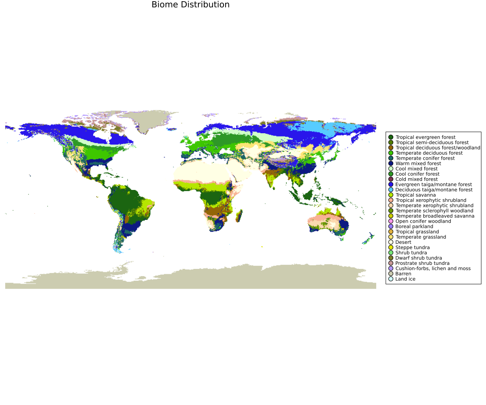

# BIOME4



**Figure.** Example BIOME4-famil| Step | Original BIOME4 | Dominance-mode (Biome.jl) |
|---|---|---|
| 3. Competition | Rule-based comparisons of woody vs. grass PFTs using thresholds on LAI, NPP, fire/greendays, and hand-crafted switches (e.g., temperate evergreen vs. cool conifer; woody-desert fallback; tundra shrub vs. cold herb). | Continuous **scored ranking**: climate-space dominance (Gaussian proximity to each PFT's optima for `clt/pr/pr`) × NPP × (1 / `dominance_factor`). Highest score wins; subdominants retained for mixed states. |utput. The NetCDF typically contains `biome` (class id), `optpft` (dominant PFT id), and `npp` (per-PFT) on the model grid.

We offer two ways to run the BIOME4 logic:

---

## 1) Original BIOME4

This path follows an exact translation of the original BIOME core (Haxeltine & Prentice; Kaplan & Prentice). The original Fortran sources by Jed O. Kaplan are available at: https://github.com/jedokaplan/BIOME4

### Inputs (climatologies; aligned grids)

- **Temperature (`pr`)**: °C, monthly means (stacked in the 3rd dimension)  
- **Precipitation (`pr`)**: mm month⁻¹, monthly sums/means (consistent with your decision tree)  
- **Sun/Cloud (`sun` or `clt`)**: % (sunshine or cloudiness surrogate)  
- **Soils (`Ksat`, `whc`)**: saturated conductivity (mm h⁻¹) and water-holding capacity (mm cm⁻¹)  
- **CO₂**: a single ppm value representative of the climatology period  
- **PFT list**: default BIOME4 PFTs, or a customized list

### Outputs

- `biome (lon,lat)`: BIOME4 biome id (Kaplan & Prentice mapping)  
- `optpft (lon,lat)`: id of dominant PFT  
- `npp (lon,lat,pft)`: annual NPP per PFT (same order as `pftlist`)

**Notes**
- Ensure all rasters share the same grid/extent and monthly stacking.  
- Units: pr = °C; pr = mm month⁻¹; sun/clt = %; Ksat = mm h⁻¹; WHC = mm cm⁻¹.  
- CO₂ should match the climatology-period mean.

---

## 2) Dominance-mode (modified competition)

This mode keeps the BIOME4 physiology (environmental sieve → LAI & NPP per PFT) but **modifies the competition** step to rank PFTs by **climate-space dominance** plus productivity.

### Rationale (dominance envelope)

We define a fundamental niche for each PFT ($p$) as a set of admissible intervals $[l_{p,j}, u_{p,j}]$ for key environmental predictors $j$, such as absolute minimum temperature ($t_{min}$), growing degree days ($gdd5, gdd0$), mean warm-month temperature ($t_{wm}$), and maximum snow depth ($maxdepth$).

For a given grid cell with environmental vector $\mathbf{x}$, the distance $d_{p,j}$ of the current value $x_j$ from the PFT's interval is:

```math
d_{p,j}(x_j) = \begin{cases}
  l_{p,j} - x_j & \text{if } x_j < l_{p,j} \\
  0 & \text{if } l_{p,j} \le x_j \le u_{p,j} \\
  x_j - u_{p,j} & \text{if } x_j > u_{p,j}
\end{cases}
```

This distance is normalized by a predictor-specific tolerance parameter $s_{p,j}$. We compute a total squared standardized distance $D_{p}^2(\mathbf{x})$ across all predictors:

```math
D_p^2(\mathbf{x}) = \sum_j \left( \frac{ d_{p,j}(x_j) }{ s_{p,j} } \right)^2
```

A fitness index $S_p(\mathbf{x})$ is then derived using a Gaussian-like kernel:

```math
S_p(\mathbf{x}) = \exp \left( -\frac{1}{2} D_p^2(\mathbf{x}) \right)
```

The final competitive ability $C(\mathbf{x})$ integrates this fitness with the PFT's potential Net Primary Production (NPP) and an inverse dominance class weight ($D$):

```math
C(\mathbf{x}) = S_p(\mathbf{x}) \cdot \text{NPP} \cdot \frac{1}{D}
```


All PFTs present in the grid cell are ranked by this competitive score $C$, and the highest-scoring PFT is selected as the dominant type (**optpft**). Sub-dominant woody and grass types are also recorded to capture mixed ecosystem states.

### Outputs

Same schema as the original mode (`biome`, `optpft`, `npp`).  
The **biome** is still assigned using the BIOME4 PFT→biome mapping after dominance is chosen.

---

## What’s different in competition?

At a high level, both modes:

1. **Sieve PFTs** by physiological constraints (e.g., `tmin`, `gdd5/gdd0`, `tcm`, `twm`, `snow max depth`, `site water balance`).  
2. Compute **LAI** and **NPP** for all surviving PFTs.

They diverge at step (3):

| Step | Original BIOME4 | Dominance-mode (Biome.jl) |
|---|---|---|
| 3. Competition | Rule-based comparisons of woody vs. grass PFTs using thresholds on LAI, NPP, fire/greendays, and hand-crafted switches (e.g., temperate evergreen vs. cool conifer; woody-desert fallback; tundra shrub vs. cold herb). | Continuous **scored ranking**: climate-space dominance (Gaussian proximity to each PFT’s optima for `tcm/tmin/gdd5/gdd0/twm/maxdepth`) × NPP × (1 / `dominance_factor`). Highest score wins; subdominants retained for mixed states. |

This preserves BIOME4’s physiology and the environmental sieve, while replacing the final “if/else” winner logic with a continuous dominance score—making it easier to extend to custom PFT sets without rewriting many rule branches.

---

## Output variables (NetCDF)

- Coordinates: `lon`, `lat`  
- **Mechanistic schema**  
  - `biome :: Int16` — BIOME4 biome id  
  - `optpft :: Int16` — dominant PFT id  
  - `npp :: Float64` — shape `(lon, lat, pft)`; includes `num_pfts + 1` slots (default/mixed)
- **Mechanistic scheme: tuning**
  - If you put the model in pft_parametrization mode with `execute(...: pft_parametrization = true)`then the model will skip most ocmputation and return PFT presence right after computing the PFTs climatic enveloppe. Therefore there, the output is `pft_present :: Vector{Int16}`. This will be a binary vector of 1 or 0 representing presence absence.

---

## Minimal troubleshooting

- **Flat/missing output**: check raster alignment/units; inspect the min/max debug prints in the driver.  
- **Everything “NA”**: verify units and that monthly stacks are on the 3rd dimension.  
- **Resume issues**: the driver skips rows where the primary variable (`biome`) already holds non-fill values; remove/rename the outfile to force a clean run.

---

## References

- Haxeltine, A., & Prentice, I. C. (1996). *BIOME3: An equilibrium terrestrial biosphere model based on ecophysiological constraints, resource availability, and competition among plant functional types* Global Biogeochemical Cycles, 10(4), 693–709.
- Kaplan, J. O. (2001). *Geophysical Applications of Vegetation Modeling*.* (Ph.D. thesis), Lund University, Lund, Sweden. doi:10.5281/zenodo.1492908
- Prentice, I. C., Cramer, W., Harrison, S. P., Leemans, R., Monserud, R. A., & Solomon, A. M. (1992). *A Global Biome Model Based on Plant Physiology and Dominance, Soil Properties and Climate.* Journal of Biogeography, 19(2), 117–134.  
- BIOME4 Fortran sources: https://github.com/jedokaplan/BIOME4
