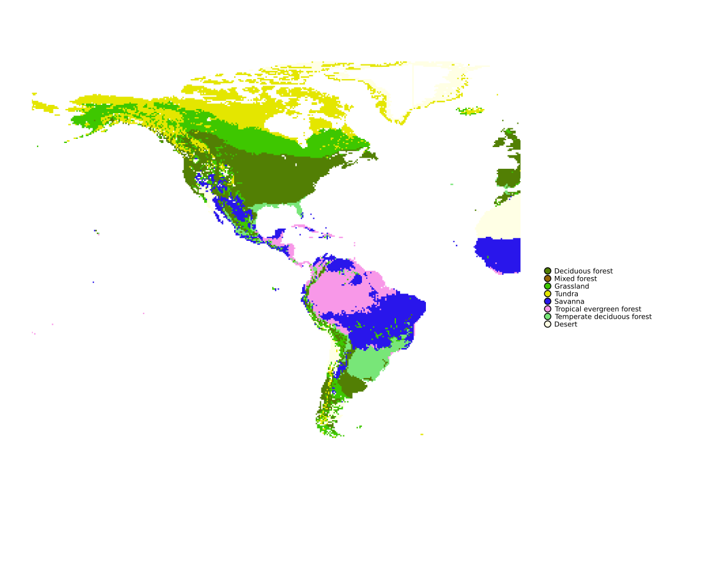

# Examples 

Here is some basic examples on how to run the package for different model types. 

## Climate Envelope models: 

````
using Biome
using Rasters

tempfile = ""
precfile = ""

temp_raster = Raster(tempfile, name="temp")
prec_raster = Raster(precfile, name="prec")

setup = ModelSetup(KoppenModel();
                   temp=temp_raster,
                   prec=prec_raster)

run!(setup; coordstring="alldata", outfile="output_Koppen.nc")

````

## Mechanistic models:

### BIOME4

For the classic BIOME4 model, you need to initialize the BIOME4-specific PFTList.

`````
PFTList = BIOME4.PFTClassification()
`````
The PFTList is by default initialized in Float64 and Int, if you would rather use another type and use a different type  in your input data, specify it. 

`````
# i.e., using Float32
PFTList = BIOME4.PFTClassification{Float32, Int}()
`````

 You are always welcome to remove some of its PFTs or to manually modify some of their characteristics. 


Below is an example of using only a subset of the BIOME4 PFTs. 
`````
PFTList = BIOME4.PFTClassification{T,U}([
        TropicalEvergreen{T,U}(),
        TropicalDroughtDeciduous{T,U}(),
        TemperateBroadleavedEvergreen{T,U}(),
        TemperateDeciduous{T,U}(),
        CoolConifer{T,U}(),
        BorealEvergreen{T,U}()])
````` 


here is how you set up an entire run of BIOME4 with you own environmental input and PFTs

`````
using Biome
using Rasters

tempfile = ""
precfile = ""
cltfile = ""
soilfile = ""

temp_raster = Raster(tempfile, name="temp")
prec_raster = Raster(precfile, name="prec")
clt_raster = Raster(cltfile, name="sun")
ksat_raster = Raster(soilfile, name="Ksat")
whc_raster = Raster(soilfile, name="whc")

PFTList = BIOME4.PFTClassification()

setup = ModelSetup(BIOME4Model();
                   temp=temp_raster,
                   prec=prec_raster,
                   sun=clt_raster,
                   ksat=ksat_raster,
                   whc=whc_raster,
                   co2=373.8,
                   pftlist = PFTList)

run!(setup; coordstring="alldata", outfile="output_biome4.nc")
`````

If you want to modify some of the PFT characteristics of you BIOME4 PFTList, you can do so usign the `set_characteristic`function, where we change the GDD5 of the "BorealEvergreen" PFT: 

`````
PFTList = BIOME4.PFTClassification()
set_characteristic!(PFTList, "BorealEvergreen", :gdd5, [600.0, Inf])
`````

## Base Model 

Without customization. 


`````
using Biome
using Rasters

tempfile = ""
precfile = ""
cltfile = ""
soilfile = ""

temp_raster = Raster(tempfile, name="temp")
prec_raster = Raster(precfile, name="prec")
clt_raster = Raster(cltfile, name="sun")
ksat_raster = Raster(soilfile, name="Ksat")
whc_raster = Raster(soilfile, name="whc")

# BasePTS
pftlist = PFTClassification([
        EvergreenPFT(),
        DeciduousPFT(),
        TundraPFT(),
        GrassPFT(),
    ]
)
setup = ModelSetup(BaseModel;
                   temp=temp_raster,
                   prec=prec_raster,
                   sun= clt_raster,
                   ksat=ksat_raster,
                   whc= whc_raster,
                   co2=373.8,
                   pftlist = pftlist)

run!(setup; coordstring="-180/0/-90/90", outfile="output_BaseModel.nc")
`````


Creating 3 new PFTs and their associated biomes

`````
using Biome
using Rasters

tempfile = ""
precfile = ""
cltfile = ""
soilfile = ""

temp_raster = Raster(tempfile, name="temp")
prec_raster = Raster(precfile, name="prec")
clt_raster = Raster(cltfile, name="sun")
ksat_raster = Raster(soilfile, name="Ksat")
whc_raster = Raster(soilfile, name="whc")

# Custom PFTs
C4Grass = GrassPFT(c4 = true)

TropicalEvergreen = EvergreenPFT(
    name = "TropicalEvergreen",
    phenological_type = 1,
    max_min_canopy_conductance = 0.5,
    Emax = 10.0,
    root_fraction_top_soil     = 0.69,
    optratioa                  = 0.95,
    kk                         = 0.7,
    t0                         = 10.0,
    tcurve                     = 1.0,
    respfact                   = 0.8,
    allocfact                  = 1.0,
    constraints = (
        tcm = [-Inf, +Inf],
        min = [0.0, +Inf],
        gdd = [-Inf, +Inf],
        gdd0 = [-Inf, +Inf],
        twm = [10.0, +Inf],
        snow = [-Inf, +Inf],
        swb = [700.0, +Inf]
    ),
    mean_val = (clt=50.2, prec=169.6, temp=24.7),
    sd_val = (clt=4.9,  prec=41.9,  temp=1.2),
    dominance_factor = 1
)

TemperateDeciduous = DeciduousPFT(
    name = "TemperateDeciduous",
    constraints = (
        tcm=[-Inf, +Inf],
        min=[-8.0, 5.0],
        gdd=[1200, +Inf],
        gdd0=[-Inf, +Inf],
        twm=[10.0, +Inf],
        snow=[-Inf, +Inf],
        swb=[400,+Inf]
    ),
    mean_val = (clt=33.4, prec=106.3, temp=18.7),
    sd_val = (clt=13.3, prec=83.6,  temp=3.2),
    dominance_factor = 1
)

struct Savanna  <: AbstractBiome
    value::Int
    Savanna() = new(6)
  end

struct TropicalEvergreenForest <: AbstractBiome
    value::Int
    TropicalEvergreenForest() = new(7)
  end

  struct TemperateDeciduousForest <: AbstractBiome
    value::Int
    TemperateDeciduousForest() = new(8)
  end
  
  
function my_biome_assign(pft::AbstractPFT;
    subpft,
    wdom,
    gdd0,
    gdd5,
    tcm,
    tmin,
    pftlist,
    PFTStates,
    gdom)
    if get_characteristic(pft, :c4)
        return Savanna()
    elseif  get_characteristic(pft, :name) == "TropicalEvergreen"
        return TropicalEvergreenForest()
    elseif get_characteristic(pft, :name) == "TemperateDeciduous"
        return TemperateDeciduousForest()
    else
    # FIXME could we make this fallback silent
        return Biome.assign_biome(pft;
                subpft=subpft, wdom=wdom,
                gdd0=gdd0, gdd5=gdd5,
                tcm=tcm, tmin=tmin,
                pftlist=pftlist,
                PFTStates=PFTStates, gdom=gdom)
    end
end


pftlist = PFTClassification([
        DeciduousPFT(),
        TundraPFT(),
        GrassPFT(),
        C4Grass,
        TropicalEvergreen,
        TemperateDeciduous
    ]
)
setup = ModelSetup(BaseModel;
                   temp=temp_raster,
                   prec=prec_raster,
                   sun= clt_raster,
                   ksat=ksat_raster,
                   whc= whc_raster,
                   co2=373.8,
                   pftlist = pftlist,
                   biome_assignment = my_biome_assign)

run!(setup; coordstring="-180/0/-90/90", outfile="output_CustomModel.nc")
`````

Such model output will look like: 

