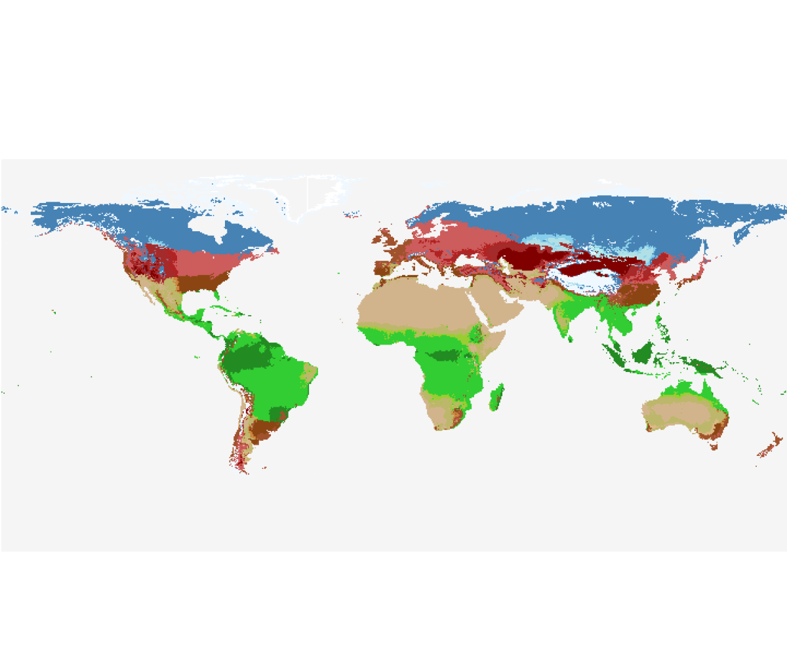

# Biome.jl a modular framework of climate-based biome prediction. 

Welcome to the documentation of Biome.jl. 

This package provides a platform for simulating climate-driven biome classification schemes alongside the mechanistic model [BIOME4](https://www.researchgate.net/publication/37470169_Geophysical_Applications_of_Vegetation_Modeling) and a modular version based on the BIOME4 logic.

## Features 

## Examples

## Credits

The following people are involved in the development of Biome.jl 
* [Capucine Lechartre](https://github.com/clechartre) - Main development 
* [Victor Boussange](https://github.com/vboussange) - Code architecture
* [Niklaus Zimmermann](https://www.wsl.ch/de/mitarbeitende/zimmerma/) - Theoretical development
* [Philipp Brun](https://www.wsl.ch/de/mitarbeitende/brunp/) - Theoretical development

All contributors are affiliated with the [Swiss Federal Institute for Forest, Snow, and Landscape Research WSL](https://www.wsl.ch/en/)