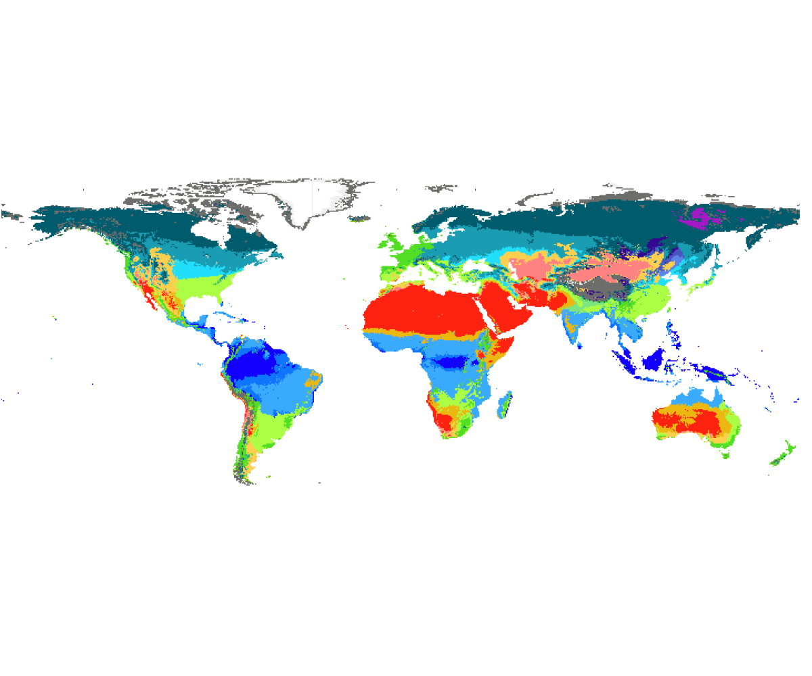

# Köppen-Geiger

The Köppen–Geiger system divides Earth’s climates into five primary groups:A (tropical), B (arid), C (temperate), D (continental) and E (polar).Each group is then further subdivided by patterns of seasonal precipitation and temperature thresholds.
This biome classification relies on metrics such as the coldest and warmest monthly mean temperatures, total and driest‑month precipitation, and the relative timing of wet and dry seasons, and outputs subtypes like Af (tropical rainforest), Cfb (oceanic) or BWh (hot desert), each mapped to a unique integer code. 





In the provided Julia implementation, the run function unpacks longitude, latitude, monthly temperature and precipitation from the input vector, computes summary statistics (min, max, mean), sums seasonal precipitation (winter vs. summer based on hemisphere), then applies the Köppen–Geiger decision tree against those thresholds and looks up the resulting symbol in a Dict{Symbol,Int} to produce a numeric climate class, finally returning that class along with the original coordinates.

You can call this model using 

`````
`````

## References

* Köppen, W. Das geographische System der Klimate, 1–44 (Gebrüder Borntraeger: Berlin, Germany, 1936).

* Beck, H., Zimmermann, N., McVicar, T. et al. Present and future Köppen-Geiger climate classification maps at 1-km resolution. Sci Data 5, 180214 (2018). https://doi.org/10.1038/sdata.2018.214

