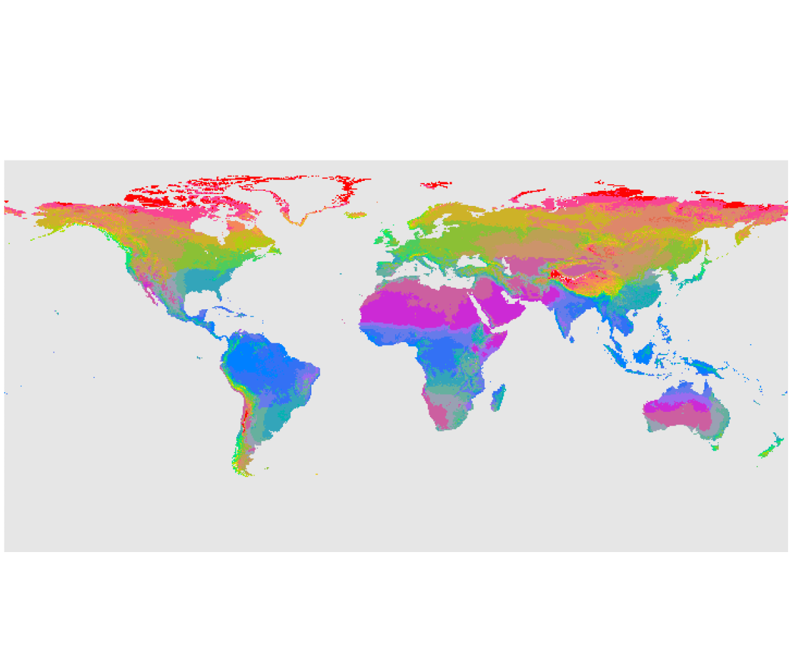

# Thornthwaite

The Thornthwaite system (1931 – 1948) classifies climates both by how effectively precipitation meets evaporative demand and by thermal efficiency. 




In our method, twelve monthly temperatures and precipitations are used to compute a precipitation‑effectiveness index (PE) and a thermal‑efficiency index. PE then places the site into one of five moisture zones (Wet, Humid, Subhumid, Semiarid, Arid), and TE into one of six temperature zones (Tropical, Mesothermal, Microthermal, Taiga, Tundra, Frost), each mapped via simple thresholds.

You can call this model using 

`````
`````

## References

* Thornthwaite, C. W. (1931). The climates of North America: According to a new classification. , 21(4),. JSTOR. Geographical Review, 633–655.