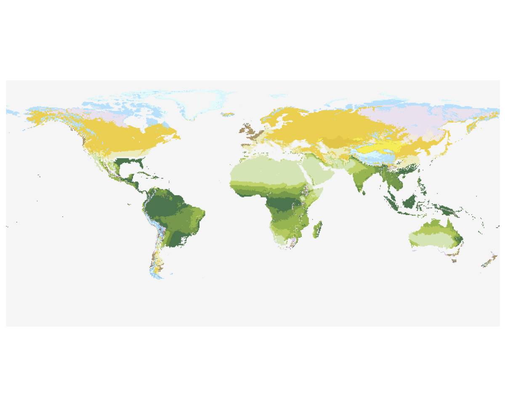

# Troll-Paffen

The Troll–Paffen scheme partitions Earth’s climates into 38 seasonal‑interference types based on the interaction of three “seasonal climates”: illumination (astronomic insolation seasons), temperature (thermic seasons) and moisture (hygric seasons) and outputs zones from polar ice‑deserts through tropical rain‑forest 

<figure>
  
  <figcaption><strong>Figure.</strong> Example Troll–Paffen classification map.</figcaption>
</figure>

The following classes can be attributed:

| Code | Class |
|---:|---|
| 1 | Polar ice-deserts |
| 2 | Polar frost-debris belt |
| 3 | Tundra |
| 4 | Sub-polar tussock grassland and moors |
| 5 | Oceanic humid coniferous woods |
| 6 | Continental coniferous woods |
| 7 | Highly continental dry coniferous woods |
| 8 | Evergreen broad-leaved and mixed woods |
| 9 | Oceanic deciduous broad-leaved and mixed woods |
| 10 | Sub-oceanic deciduous broad-leaved and mixed woods |
| 11 | Sub-continental deciduous broad-leaved and mixed woods |
| 12 | Continental deciduous broad-leaved and mixed woods as well as wooded steppe |
| 13 | Highly continental deciduous broad-leaved and mixed woods as well as wooded steppe |
| 14 | Deciduous broad-leaved and mixed wood and wooded steppe |
| 15 | Thermophile dry wood and wooded steppe |
| 16 | Humid deciduous broad-leaved and mixed wood |
| 17 | High grass-steppe with perennial herbs |
| 18 | Humid steppe with mild winters |
| 19 | Short grass-, dwarf shrub-, or thorn-steppe |
| 20 | Steppe with short grass, dwarf shrubs and thorns |
| 21 | Central and East-Asian grass and dwarf shrub steppe |
| 22 | Semi-desert and desert with cold winters |
| 23 | Semi-desert and desert with mild winters |
| 24 | Sub-tropical hard-leaved and coniferous wood |
| 25 | Sub-tropical grass and shrub-steppe |
| 26 | Sub-tropical thorn- and succulents-steppe |
| 27 | Sub-tropical steppe with short grass |
| 28 | Sub-tropical semi-deserts and deserts |
| 29 | Sub-tropical high-grassland |
| 30 | Sub-tropical humid forests |
| 31 | Evergreen tropical rain forest |
| 32 | Rain-green humid forest |
| 33 | Half-deciduous transition wood |
| 34 | Rain-green dry wood and savannah |
| 35 | Tropical thorn-succulent wood and savannah |
| 36 | Tropical dry climates with humid months in winter |
| 37 | Tropical semi-deserts and deserts |
| 38 | Not Classified / NA |


In the provided implementation, twelve monthly temperatures and precipitations are first reduced to statistics (min, max, mean, range, annual total), as well as derived metrics—growing‑degree days above 5 °C and the average number of humid months where daily rainfall exceeds twice daily temperature (via get_growing_degree_days and get_humid_months). A decision tree then applies Troll–Paffen thresholds (e.g. temp_max < 0 °C → “Polar ice‑desert”, ranges of growing‑degree days and humid‑month counts for boreal, temperate, steppe, subtropical and tropical belts, with hemisphere‑adjusted seasonal humidity criteria).

You can call this model using: 

```julia
using Biome
using Rasters

# Minimal inputs (Troll–Paffen uses tas & pr in the driver)
tasfile = "/path/to/tas.nc"   # monthly mean temperature (stacked in 3rd dim)
prfile = "/path/to/pr.nc"   # monthly precipitation (same grid/stacking)

tas_raster = Raster(tasfile, name="tas")
pr_raster = Raster(prfile,  name="pr")

setup = ModelSetup(TrollPfaffenModel();
                   tas=tas_raster,
                   pr=pr_raster)

# Process full grid (or pass "lonmin/lonmax/latmin/latmax")
execute(setup; outfile="output_TrollPfaffen.nc")
```


## References

* Troll, C. (1964). Karte der Jahreszeiten-Klimate der Erde. ERDKUNDE, 18(1), Article 1. https://doi.org/10.3112/erdkunde.1964.01.02


