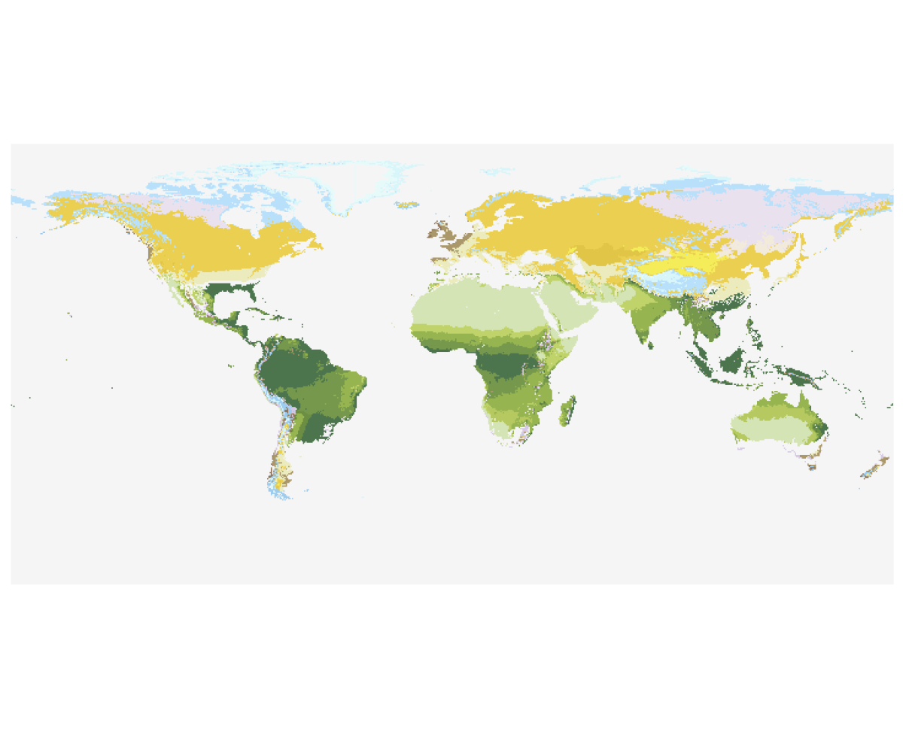

# Troll-Pfaffen

The Troll–Paffen scheme partitions Earth’s climates into 38 seasonal‑interference types based on the interaction of three “seasonal climates”: illumination (astronomic insolation seasons), temperature (thermic seasons) and moisture (hygric seasons) and outputs zones from polar ice‑deserts through tropical rain‑forest 



In the provided implementation, twelve monthly temperatures and precipitations are first reduced to statistics (min, max, mean, range, annual total), as well as derived metrics—growing‑degree days above 5 °C and the average number of humid months where daily rainfall exceeds twice daily temperature (via get_growing_degree_days and get_humid_months). A decision tree then applies Troll–Paffen thresholds (e.g. temp_max < 0 °C → “Polar ice‑desert”, ranges of growing‑degree days and humid‑month counts for boreal, temperate, steppe, subtropical and tropical belts, with hemisphere‑adjusted seasonal humidity criteria).

You can call this model using 

`````
`````

## References

* Troll, C. (1964). Karte der Jahreszeiten-Klimate der Erde. ERDKUNDE, 18(1), Article 1. https://doi.org/10.3112/erdkunde.1964.01.02