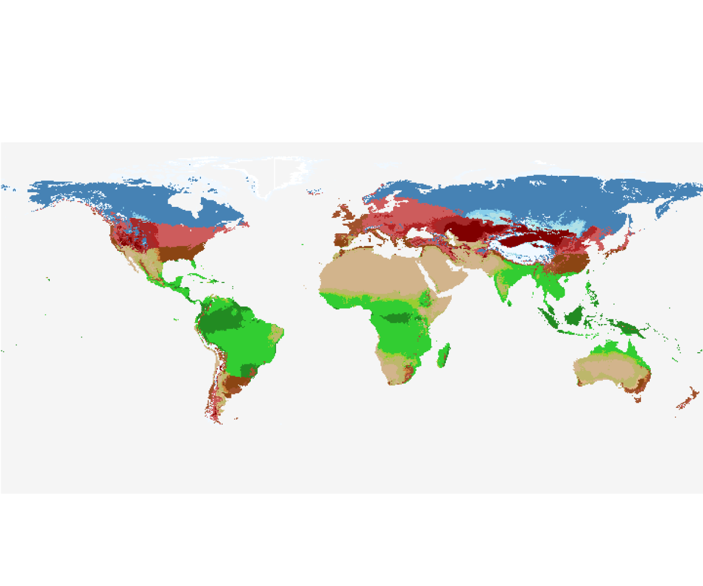

# Wissmann

The Wissmann scheme partitions climates into six major groups (from Tropical through Polar) and within each applies moisture thresholds to distinguish rainforest, monsoonal, steppe and desert subtypes.

<figure>
  
  <figcaption><strong>Figure.</strong> Example Wissmann classification map.</figcaption>
</figure>

In the provided function, the twelve monthly temperatures and precipitations are first summarized (min, max, mean temperatures; total and minimum precipitation; plus seasonal sums for “winter” and “summer” based on hemisphere). A dynamic precipitation threshold (`t_threshold`) is computed as ten times the mean annual temperature (shifted by +14 °C if summer is wetter than winter). The main classes are applied with thresholds:

* **Polar** — Group VI if `t_max < 0 °C`; Group V if `t_max < 10 °C`.
* **Boreal** — Group IV when `t_mean < 4 °C`, with four moisture subtypes (IV_F humid, IV_T winter-dry, IV_S steppe, IV_D desert) based on precipitation relative to **1×**, **2×**, or **2.5×** `t_threshold`.
* **Cool temperate** — Group III when `t_min < 2 °C`, with analogous moisture splits and a winter-vs-summer dry distinction for **Ts/Tw** subtypes.
* **Warm temperate** — Group II when `2 °C ≤ t_min < 13 °C`; hot summers (`t_max > 23 °C`) split **Fa/Fb** (humid), and **Ts/Tw** or **IS/ID** for intermediate/arid regimes.
* **Tropical** — Group I when `t_min ≥ 13 °C`; driest-month check (`precip_min ≥ 60 mm`) yields **IA** rainforest, otherwise **IF** (weak dry period), **IT** (monsoonal), **IS** (savanna) or **ID** (desert) via the same 1–2.5× threshold bins.

## How to run it

```julia
using Biome
using Rasters

# Minimal inputs
tasfile = "/path/to/tas.nc"   # monthly mean temperature (stacked in 3rd dim)
prfile = "/path/to/pr.nc"   # monthly precipitation (same grid/stacking)

tas_raster = Raster(tasfile, name="tas")
pr_raster = Raster(prfile,  name="pr")

setup = ModelSetup(WissmannModel();
                   tas=tas_raster,
                   pr=pr_raster)

execute(setup; outfile="output_Wissmann.nc")
```

# References
* Wissmann, H. (1939). In Die Klima- und Vegetationsgebiete Eurasiens: Begleitworte zu einer Karte der Klimagebiete Eurasiens (pp. 81–92). Erdk. Berlin.